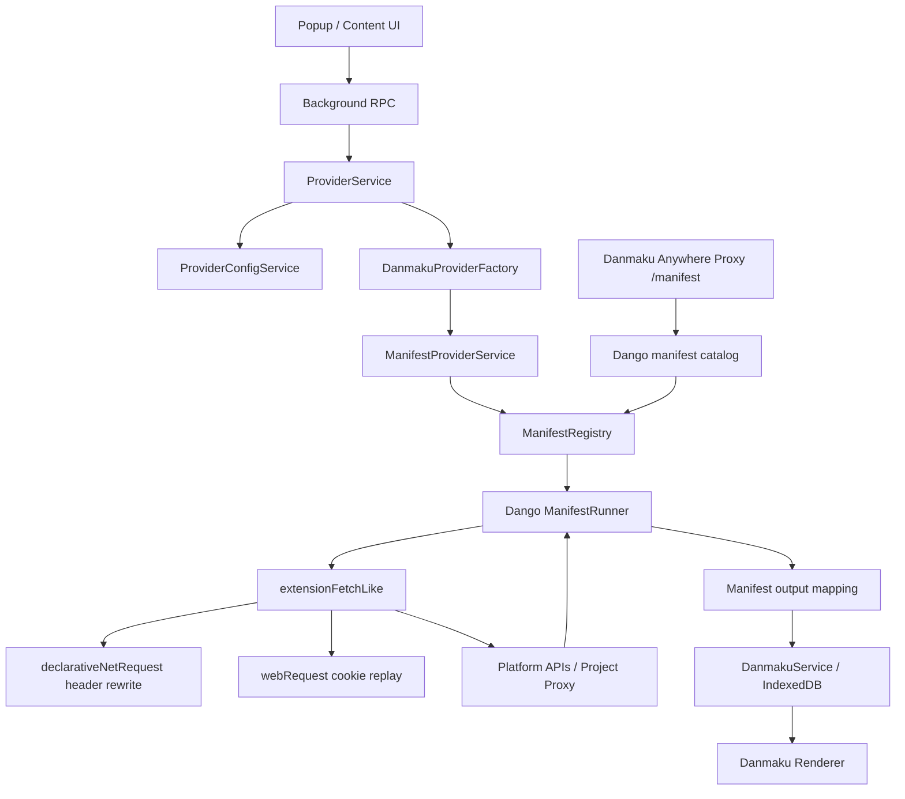
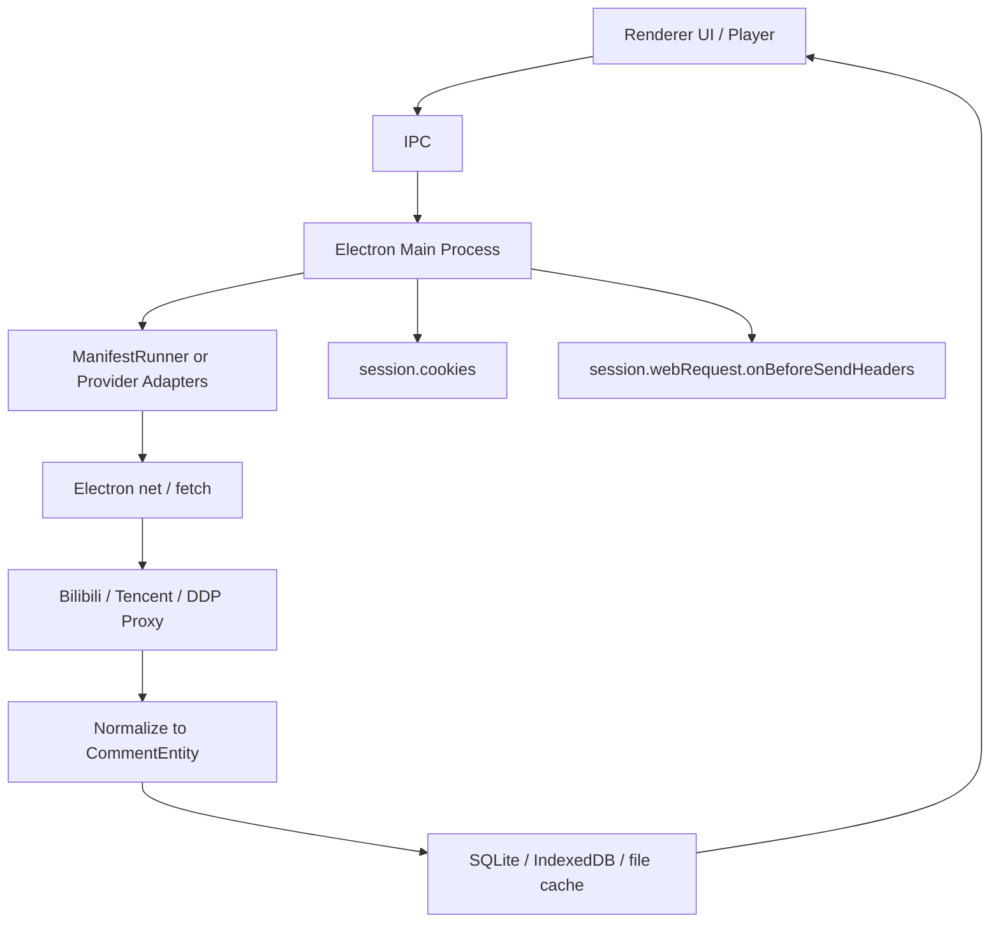

# Danmaku Anywhere 弹幕源方案记录

本文记录 `Mr-Quin/danmaku-anywhere` 中弹幕源获取方案，重点覆盖弹弹play、B 站、腾讯视频三个来源。内容基于源码调研，适合作为后续在浏览器扩展、Electron 客户端或自有播放器中复用该方案的设计参考。

## 1. 调研范围

调研对象：

- `Mr-Quin/danmaku-anywhere`
  - 仓库：`https://github.com/Mr-Quin/danmaku-anywhere`
  - 本次查看提交：`0368490eeebf812843c24896e7a73f1372c854da`
- `Mr-Quin/dango`
  - 仓库：`https://github.com/Mr-Quin/dango`
  - 本次查看提交：`d8b45512a1bcbe21d7bc60aaf8b07a22fe328374`

需要特别区分两层代码：

- `packages/danmaku-provider/src/providers/*`：仓库内仍保留的 TypeScript API 封装，包含 `ddp`、`bilibili`、`tencent` 等 provider。它能说明平台接口形态，也被测试和部分工具使用。
- 当前浏览器扩展的主路径：`packages/danmaku-anywhere/src/background/services/providers/*` 使用 `@mr-quin/dango` 的 `ManifestRunner` 执行远端下发的 JSON manifest。内置弹幕源的接口编排主要在 `dango` 仓库的 `packages/dango-manifests/src/manifests/*.json` 中。

也就是说，当前更重要的实现不是每个平台一套 TypeScript 类，而是：

> 平台接口逻辑被声明在 manifest JSON 中，扩展后台脚本统一执行这些 manifest。

## 2. 总体结论

Danmaku Anywhere 的弹幕源方案可以概括为：

1. 扩展安装或刷新时，从项目后端 proxy 拉取 manifest catalog。
2. catalog 指向 `dango-manifests` 中的各个平台 manifest。
3. 扩展把 manifest 存到本地，并为每个 manifest 构建 `ManifestRunner`。
4. 用户搜索番剧时，扩展执行 manifest 的 `search` pipeline。
5. 用户选择条目后，扩展执行 `episodes` pipeline 获取剧集列表。
6. 播放某一集时，扩展执行 `danmaku` pipeline 获取弹幕。
7. 弹幕被统一转换为项目内部的 `{ p, m }` 结构，并缓存到本地。

这种设计的核心价值是：

- 平台接口变化时，可以更新 manifest，不一定要重新发布扩展。
- B 站、腾讯、弹弹play等不同来源被抽象成同一套 `search / episodes / danmaku / parseUrl / loginProbe` 管线。
- 请求由扩展后台脚本发起，可以使用扩展权限处理跨域、Referer、Origin、Cookie 等浏览器普通网页脚本无法处理的问题。

## 3. 高层架构



关键模块：

- `ManifestRegistry`：负责拉取 catalog、下载 manifest、构建 runner、管理更新。
- `ManifestProviderService`：把统一的 provider 接口映射到 runner 的 `runSearch`、`runEpisodes`、`runDanmaku`。
- `ProviderService`：业务入口，负责搜索、保存 season、获取 episodes、拉取并缓存弹幕。
- `extensionFetchLike`：manifest runner 使用的 fetch 实现，负责 header rewrite 和 cookie replay。
- `dango-manifests`：真正描述各个平台接口调用的 JSON manifest。

## 4. Manifest 生命周期

### 4.1 catalog 来源

扩展里的 `ManifestRegistry` 通过 `VITE_PROXY_URL` 请求：

```text
GET {VITE_PROXY_URL}/manifest
GET {VITE_PROXY_URL}/manifest/file?file=src/manifests/bilibili.json
```

后端 proxy 的 `/manifest` 路由再转发到：

```text
https://raw.githubusercontent.com/Mr-Quin/dango/main/packages/dango-manifests/catalog.json
https://raw.githubusercontent.com/Mr-Quin/dango/main/packages/dango-manifests/{file}
```

catalog 中会列出每个内置源：

```json
{
  "id": "bilibili",
  "name": "Bilibili",
  "version": "0.5.0",
  "apiVersion": 1,
  "file": "src/manifests/bilibili.json"
}
```

### 4.2 本地注册和更新

`ManifestRegistry` 做几件事：

- 读取本地已经存储的 manifest。
- 拉取远端 catalog。
- 下载缺失的 manifest。
- 对 manifest 做 schema 校验。
- 用 `new ManifestRunner(manifest, { fetcher: extensionFetchLike })` 创建 runner。
- 检查远端 manifest 版本和本地版本差异，显示可更新项。

首次安装时，`ProviderService.seedDefaultProviders()` 会在 catalog 加载完成后，创建默认 provider 配置。

默认内置 provider：

| provider | manifestId | 默认配置 |
| --- | --- | --- |
| 弹弹play | `dandanplay` | `baseUrl = {VITE_PROXY_URL}/ddp`，`chConvert = 0` |
| B 站 | `bilibili` | `danmakuFormat = xml` |
| 腾讯视频 | `tencent` | 无额外默认配置 |

## 5. 数据模型

### 5.1 ProviderConfig

扩展保存的弹幕源配置是扁平结构：

```ts
{
  id: string
  manifestId: string
  name: string
  enabled: boolean
  configValues: Record<string, unknown>
}
```

含义：

- `id`：用户安装的某个弹幕源实例 ID。
- `manifestId`：它使用哪个 manifest，例如 `dandanplay`。
- `configValues`：传给 manifest 的配置，例如弹弹play `baseUrl`、B 站 `danmakuFormat`。

### 5.2 Season 和 Episode providerIds

每个平台搜索结果会输出统一的 season 结构，但 `providerIds` 保留平台自己的关键 ID。

例子：

```ts
// B 站 season
providerIds: {
  seasonId: 41410,
  mediaId: 28237119
}

// B 站 episode
providerIds: {
  cid: 1300001,
  aid: 123,
  bvid: "BV...",
  epid: 700002
}

// 腾讯 season
providerIds: {
  cid: "mzc00200..."
}

// 腾讯 episode
providerIds: {
  vid: "m00253deqqo",
  cid: "mzc00200..."
}

// 弹弹play episode
providerIds: {
  episodeId: 12345,
  animeId: 67890,
  bangumiId: "..."
}
```

### 5.3 弹幕结构

弹幕最终统一为 `CommentEntity`，常见形态：

```ts
{
  p: "time,mode,color,userHash",
  m: "弹幕文本"
}
```

其中 `p` 是逗号分隔字符串：

- `time`：出现时间，秒。
- `mode`：弹幕模式。滚动弹幕通常映射为 `1`。
- `color`：十进制颜色值，例如白色 `16777215`。
- `userHash`：用户标识或空字符串。

## 6. 请求执行机制

### 6.1 ManifestRunner 输入合并

每次执行 manifest 时，输入按优先级合并：

1. manifest `configSchema` 默认值。
2. 用户保存的 `configValues`。
3. 本次调用传入的 `providerIds` 或 `meta.params`。

这样同一个 `dandanplay` manifest 可以同时支持：

- 官方弹弹play API。
- Danmaku Anywhere 自己的 proxy。
- 用户自建的弹弹play兼容 API。

### 6.2 扩展后台请求

manifest 中声明的请求由 `extensionFetchLike` 执行。

它解决三个问题：

1. 普通 `fetch()` 不能设置某些 forbidden headers，例如 `Referer`、`Origin`、`Cookie`。
2. B 站和腾讯接口对 `Referer`、`Origin` 或 Cookie 有要求。
3. Service Worker fetch 在某些场景不会自动带上分区 Cookie。

解决方式：

- manifest 的请求可声明 `rewriteHeaders`。
- `extensionFetchLike` 看到 `rewriteHeaders` 后，调用 `setSessionHeader()`。
- `setSessionHeader()` 创建临时 `chrome.declarativeNetRequest` session rule，修改请求头。
- 请求完成后移除该临时规则。
- `cookieReplay` 用 `chrome.webRequest.onHeadersReceived` 捕获 `Set-Cookie`，之后按 host 回放 Cookie。

扩展权限中包含：

```ts
permissions: [
  "storage",
  "activeTab",
  "scripting",
  "declarativeNetRequestWithHostAccess",
  "webRequest",
  ...
]

host_permissions: [
  "https://*/*",
  "http://*/*",
  "file:///*"
]
```

这是方案能在浏览器扩展中运行的基础。

## 7. 弹弹play方案

### 7.1 当前接入方式

弹弹play manifest 是一个通用 DDP 源，支持：

- 官方弹弹play API。
- Danmaku Anywhere proxy。
- 自托管的弹弹play兼容 API。

manifest 的 `hosts` 是 `["*"]`，因为 `baseUrl` 由配置决定。

扩展默认配置把 `baseUrl` 指到：

```text
{VITE_PROXY_URL}/ddp
```

manifest 再拼接 `/api/v2/...`，所以默认请求形态类似：

```text
GET {VITE_PROXY_URL}/ddp/api/v2/search/anime?keyword=...
GET {VITE_PROXY_URL}/ddp/api/v2/bangumi/{bangumiId}
GET {VITE_PROXY_URL}/ddp/api/v2/comment/{episodeId}?withRelated=true&chConvert=...
```

proxy 的 `/ddp/api/*` 透明转发给 `DDP_SERVICE`。服务端可以处理签名、转发或兼容弹弹play上游。

### 7.2 官方 API 模式

如果 `baseUrl` 为空，manifest 默认使用：

```text
https://api.dandanplay.net
```

官方 API 需要开放平台签名时，manifest 支持配置：

```text
appId
appSecret
```

请求头会被构造为：

```text
X-AppId: {appId}
X-Timestamp: {timestamp}
X-Signature: Base64(SHA256(appId + timestamp + path + appSecret))
```

注意：如果把 `appSecret` 放进客户端，无论浏览器扩展还是 Electron，理论上都可以被逆向提取。生产方案更推荐走自家 proxy，在服务端签名。

### 7.3 自定义兼容服务

manifest 还支持：

```ts
auth: {
  enabled: boolean
  headers: Array<{ key: string, value: string }>
}
```

这允许用户配置自建弹弹play兼容服务，例如私有 token、Basic Auth 或其他 headers。

### 7.4 查询链路

搜索：

```text
GET /api/v2/search/anime?keyword={q}
```

输出 season：

```ts
{
  providerIds: {
    animeId,
    bangumiId
  },
  indexedId: String(animeId),
  title: animeTitle,
  type,
  imageUrl,
  episodeCount,
  year
}
```

剧集：

```text
GET /api/v2/bangumi/{bangumiId}
```

输出 episode：

```ts
{
  providerIds: {
    episodeId,
    animeId,
    bangumiId
  },
  indexedId: String(episodeId),
  title: episodeTitle,
  episodeNumber
}
```

弹幕：

```text
GET /api/v2/comment/{episodeId}?withRelated=true&chConvert={0|1|2}
```

输出：

```ts
comments.comments
```

弹弹play API 本身已经返回接近项目内部格式的弹幕，因此 manifest 直接输出 `comments.comments`。

## 8. B 站方案

### 8.1 关键特点

B 站当前使用 Web API，不是官方 SDK。

关键点：

- 需要访问 `api.bilibili.com`。
- 搜索接口使用 WBI 签名。
- 需要带 `Referer: https://www.bilibili.com/`。
- 部分请求需要 `credentials: include`，依赖用户浏览器中的 B 站 Cookie。
- 支持 XML 和 protobuf 两种弹幕接口。

manifest 中声明：

```json
"hosts": ["api.bilibili.com"]
```

URL 解析支持：

```text
https://www.bilibili.com/bangumi/play/ss{seasonId}
https://www.bilibili.com/bangumi/play/ep{episodeId}
```

### 8.2 搜索链路

第一步，请求 nav 获取 WBI 图片 key：

```text
GET https://api.bilibili.com/x/web-interface/nav
Referer: https://www.bilibili.com/
credentials: include
```

从响应中提取：

```text
data.wbi_img.img_url -> imgKey
data.wbi_img.sub_url -> subKey
```

第二步，计算：

```text
mixinKey = permute(imgKey + subKey).slice(0, 32)
wts = now()
w_rid = md5(sortedQueryString(params) + mixinKey)
```

第三步，并行搜索两类媒体：

```text
GET https://api.bilibili.com/x/web-interface/wbi/search/type
  ?keyword={q}
  &search_type=media_bangumi
  &wts={wts}
  &w_rid={w_rid}

GET https://api.bilibili.com/x/web-interface/wbi/search/type
  ?keyword={q}
  &search_type=media_ft
  &wts={wts}
  &w_rid={w_rid}
```

输出 season：

```ts
{
  providerIds: {
    seasonId: season_id,
    mediaId: media_id
  },
  indexedId: String(season_id),
  title: stripHtml(title),
  type: season_type_name,
  imageUrl: cover,
  episodeCount: ep_size,
  year
}
```

### 8.3 剧集链路

```text
GET https://api.bilibili.com/pgc/view/web/season?season_id={seasonId}
Referer: https://www.bilibili.com/
credentials: include
```

从 `season.result.episodes` 提取剧集，并过滤 badge 包含“预告”的条目。

输出 episode：

```ts
{
  providerIds: {
    cid,
    aid,
    bvid,
    epid: id
  },
  indexedId: String(cid),
  title: long_title || show_title,
  episodeNumber,
  imageUrl: cover,
  alternativeTitle
}
```

B 站获取弹幕最关键的 ID 是 `cid`。

### 8.4 弹幕链路：XML

当 `danmakuFormat = "xml"` 时：

```text
GET https://api.bilibili.com/x/v1/dm/list.so?oid={cid}
Referer: https://www.bilibili.com/
credentials: include
```

响应是 XML，`<d p="...">文本</d>`。manifest 将其映射为：

```ts
{
  p: "{time},{mode},{color},{userHash}",
  m: text
}
```

XML 接口是旧接口，注释中说明大约有条数上限，默认扩展为了兼容旧用户配置仍 pin 到 XML。

### 8.5 弹幕链路：protobuf 分段

当使用 protobuf 格式时：

```text
GET https://api.bilibili.com/x/v2/dm/web/seg.so
  ?type=1
  &oid={cid}
  &segment_index={1..100}
Referer: https://www.bilibili.com/
credentials: include
```

特点：

- 每个 segment 大约覆盖 6 分钟。
- manifest 内置 protobuf descriptor。
- 使用 `dm.v1.DmSegMobileReply` 解码。
- 顺序请求，`concurrency = 1`。
- 每次间隔 `throttleMs = 200`。
- 接受 HTTP 304，B 站可能用 304 表示后续段没有弹幕。
- 连续空段达到阈值后停止。

输出：

```ts
{
  p: "{progress / 1000},{mode},{color},{midHash}",
  m: content
}
```

### 8.6 登录探测

B 站 manifest 有 `loginProbe`：

```text
GET https://api.bilibili.com/x/web-interface/nav
```

输出：

```ts
nav.data.isLogin = true
```

如果未登录或 Cookie 异常，扩展可以提示用户访问 `https://www.bilibili.com` 设置 Cookie。

## 9. 腾讯视频方案

### 9.1 关键特点

腾讯视频使用两个域名：

```text
pbaccess.video.qq.com
dm.video.qq.com
```

manifest 中声明：

```json
"hosts": ["pbaccess.video.qq.com", "dm.video.qq.com"]
```

URL 解析支持：

```text
https://v.qq.com/x/cover/{cid}/{vid}.html
```

所有关键请求都需要模拟来自腾讯视频网页：

```text
Origin: https://v.qq.com
Referer: https://v.qq.com/
```

### 9.2 搜索链路

搜索接口：

```text
POST https://pbaccess.video.qq.com/trpc.videosearch.mobile_search.MultiTerminalSearch/MbSearch?vplatform=2
Content-Type: application/json
Origin: https://v.qq.com
Referer: https://v.qq.com/
```

请求体中包含一组固定参数，例如：

```json
{
  "version": "25071701",
  "clientType": 1,
  "uuid": "0379274D-05A0-4EB6-A89C-878C9A460426",
  "query": "{q}",
  "pagenum": 0,
  "pagesize": 30,
  "extraInfo": {
    "multi_terminal_pc": "1",
    "themeType": "1",
    "sugRelatedIds": "{}",
    "appVersion": ""
  }
}
```

结果优先读取：

```text
search.data.areaBoxList[boxId = "MainNeed"].itemList
```

如果没有，则读取：

```text
search.data.normalList.itemList
```

输出 season：

```ts
{
  providerIds: {
    cid: doc.id
  },
  indexedId: doc.id,
  title: videoInfo.title,
  type: videoInfo.typeName,
  imageUrl: videoInfo.imgUrl,
  episodeCount: videoInfo.episodeSites[0].totalEpisode,
  year: videoInfo.year
}
```

### 9.3 剧集链路

剧集接口：

```text
POST https://pbaccess.video.qq.com/trpc.universal_backend_service.page_server_rpc.PageServer/GetPageData
  ?video_appid=3000010
  &vversion_name=8.2.96
  &vversion_platform=2
Content-Type: application/json
Origin: https://v.qq.com
Referer: https://v.qq.com/
```

请求体核心字段：

```json
{
  "has_cache": 1,
  "pageParams": {
    "cid": "{cid}",
    "lid": "0",
    "vid": "",
    "req_from": "web_mobile",
    "page_type": "detail_operation",
    "page_id": "vsite_episode_list",
    "id_type": "1",
    "page_size": "100",
    "page_context": "episode_begin=1&episode_end=100&episode_step=100"
  }
}
```

分页逻辑：

- manifest 使用 `forEach` 遍历 page `0..5`。
- 每页 100 条。
- 当本页返回少于 100 条时停止。
- 过滤 `is_trailer = "1"` 的预告片。

输出 episode：

```ts
{
  providerIds: {
    vid,
    cid
  },
  indexedId: vid,
  title: play_title,
  episodeNumber,
  alternativeTitle: [union_title],
  imageUrl: image_url
}
```

腾讯获取弹幕最关键的 ID 是 `vid`。

### 9.4 弹幕链路

第一步，获取弹幕分段索引：

```text
GET https://dm.video.qq.com/barrage/base/{vid}
Origin: https://v.qq.com
Referer: https://v.qq.com/
```

从响应中提取：

```text
base.segment_index.*.segment_name
```

第二步，并发请求各个 segment：

```text
GET https://dm.video.qq.com/barrage/segment/{vid}/{segment_name}
Origin: https://v.qq.com
Referer: https://v.qq.com/
```

执行参数：

- `concurrency = 4`
- `throttleMs = 100`
- 收集 `barrage_list`

输出映射：

```ts
{
  p: "{time_offset / 1000},1,{color},{vuid}",
  m: content
}
```

颜色处理：

- 优先读取 `content_style.gradient_colors[0]`。
- 否则读取 `content_style.color`。
- 如果没有颜色，则默认白色 `16777215`。

### 9.5 登录探测

腾讯 manifest 的 `loginProbe` 请求固定详情页接口：

```text
POST PageServer/GetPageData
```

输出：

```ts
details.ret = 0
```

它更像是“接口可访问性探测”，不一定代表真实用户账号状态。

## 10. 缓存与持久化

弹幕获取入口在 `ProviderService.getDanmaku()`。

流程：

1. 根据请求解析出 episode meta。
2. 查询本地 `DanmakuService` 是否已有同一 provider、season、indexedId 的弹幕。
3. 如果存在且没有 `forceUpdate`，直接返回本地缓存。
4. 如果不存在或强制刷新，调用 provider 拉取弹幕。
5. 将结果写入本地数据库。

缓存字段包括：

- provider
- providerConfigId
- indexedId
- seasonId
- comments
- commentCount
- lastChecked

这样做的好处：

- 避免重复打平台接口。
- 用户删除 provider 配置后，已缓存弹幕仍然可以查看。
- 弹幕源更新失败时，旧弹幕仍有兜底。

## 11. 为什么需要浏览器扩展能力

B 站和腾讯这类 Web API 通常依赖：

- Cookie。
- Referer。
- Origin。
- 浏览器式 User-Agent。
- 某些请求签名或页面上下文。

普通网页脚本的问题：

- 跨域请求受 CORS 限制。
- 不能任意设置 `Referer`、`Origin`、`Cookie` 等 forbidden headers。
- 很难读取或复用另一个站点的 Cookie。

Danmaku Anywhere 使用扩展权限解决：

- `host_permissions: ["https://*/*", "http://*/*"]` 允许后台访问外站。
- `declarativeNetRequestWithHostAccess` 允许临时改请求头。
- `webRequest` 捕获 `Set-Cookie`，用于 cookie replay。
- `credentials: include` 配合用户已有登录态访问平台接口。

这是这套方案能在 Chrome / Edge / Firefox 扩展中成立的关键。

## 12. 如果移植到 Electron

如果要把这套方案移植到 Electron，建议保留“平台逻辑声明化”的思路，但网络层需要替换。

### 12.1 推荐架构



### 12.2 网络层替代方案

浏览器扩展中的能力：

```text
chrome.declarativeNetRequest
chrome.webRequest
chrome.cookies / browser cookies
service worker fetch
```

Electron 中可替代为：

```text
session.defaultSession.webRequest.onBeforeSendHeaders
session.defaultSession.cookies
electron.net.fetch 或 Node fetch
自建 cookie jar
```

建议：

- 所有平台 API 请求放在 main process，不要让 renderer 直接打。
- 对 B 站、腾讯请求统一加 Referer/Origin。
- B 站登录态可以通过独立 BrowserWindow 打开 `https://www.bilibili.com`，让用户登录后复用同一个 Electron session 的 Cookie。
- 腾讯类似，可打开 `https://v.qq.com` 设置 Cookie。
- 弹弹play官方 `appSecret` 不建议放客户端，推荐走自家 proxy。

### 12.3 是否继续使用 dango manifest

可以考虑继续使用：

- 好处：平台接口变化时只更新 manifest。
- 好处：B 站、腾讯、弹弹play保持同一套 pipeline。
- 代价：需要在 Electron 中实现一个等价的 `FetchLike`，支持：
  - JSON / text / XML / protobuf 响应。
  - header rewrite。
  - credentials/cookie。
  - 请求节流和并发。

如果不使用 manifest，也可以把三个平台写成固定 TypeScript adapter，但接口变化时需要重新发客户端。

## 13. 风险点

### 13.1 平台接口稳定性

B 站和腾讯的 Web API 不是为第三方稳定承诺的 SDK。风险包括：

- 接口路径变化。
- 请求参数变化。
- 签名规则变化。
- 反爬策略变化。
- Cookie 或 Referer 要求变化。
- 响应结构变化。

缓解方式：

- 保持 manifest 热更新。
- 为每个平台维护 fixture 测试。
- 定期跑真实 API smoke test。
- 请求失败时保留本地缓存，不影响已下载弹幕播放。

### 13.2 账号和 Cookie

B 站和腾讯可能要求用户登录或具备地区/会员权限。

需要注意：

- 不要收集用户账号密码。
- 只复用用户在浏览器或 Electron session 中已有的 Cookie。
- 提供“访问平台官网以设置 Cookie”的入口。
- 对失败原因做清晰提示。

### 13.3 弹弹play签名密钥

官方弹弹play API 如果需要 `appSecret`：

- 浏览器扩展和 Electron 客户端都无法真正保密。
- 最好用服务端 proxy 代签。
- 如果支持用户自填密钥，要明确风险。

### 13.4 请求频率

protobuf 分段弹幕和腾讯 segment 弹幕都可能产生多次请求。

当前 manifest 已经包含节流：

- B 站 protobuf：`throttleMs = 200`，顺序请求。
- 腾讯 segment：`concurrency = 4`，`throttleMs = 100`。

移植时应保留节流，避免触发平台风控。

## 14. 可复用实施清单

如果要在新项目中实现类似方案，建议按这个顺序：

1. 先定义统一弹幕结构：`{ p, m }` 或更强类型的内部结构。
2. 定义 provider 接口：`search(q)`、`episodes(seasonIds)`、`danmaku(episodeIds)`、`parseUrl(url)`。
3. 实现网络层：
   - 能设置 Referer/Origin。
   - 能带 Cookie。
   - 能处理 XML、JSON、protobuf。
   - 能节流和限制并发。
4. 接入弹弹play：
   - 优先走自家 proxy。
   - 支持自定义兼容 API。
   - 弹幕接口 `/api/v2/comment/{episodeId}`。
5. 接入 B 站：
   - 实现 WBI 签名。
   - 搜索 `media_bangumi` 和 `media_ft`。
   - season 接口获取 `cid`。
   - 先支持 XML，再考虑 protobuf 全量弹幕。
6. 接入腾讯：
   - 搜索 `MultiTerminalSearch/MbSearch`。
   - 剧集 `PageServer/GetPageData`。
   - 弹幕 `barrage/base` + `barrage/segment`。
7. 做本地缓存：
   - 按 provider、season、episode indexedId 缓存。
   - 支持强制刷新。
8. 做错误提示：
   - 未登录。
   - 接口变更。
   - 地区限制。
   - 请求被风控。
9. 建测试资产：
   - 每个平台保留搜索、剧集、弹幕 fixture。
   - 对映射后的 canonical 弹幕结构做断言。

## 15. 关键源码索引

Danmaku Anywhere：

- Manifest 拉取和注册：`packages/danmaku-anywhere/src/background/services/providers/ManifestRegistry.ts`
- Provider 统一封装：`packages/danmaku-anywhere/src/background/services/providers/ManifestProviderService.ts`
- Provider 业务入口和缓存：`packages/danmaku-anywhere/src/background/services/providers/ProviderService.ts`
- 默认 provider 配置：`packages/danmaku-anywhere/src/common/options/providerConfig/constant.ts`
- 扩展 fetcher：`packages/danmaku-anywhere/src/background/services/providers/extensionFetchLike.ts`
- DNR 请求头改写：`packages/danmaku-anywhere/src/background/netRequest/setSessionHeader.ts`
- Cookie replay：`packages/danmaku-anywhere/src/background/netRequest/cookieReplay.ts`
- 扩展权限：`packages/danmaku-anywhere/manifest.ts`
- 后端 manifest proxy：`backend/proxy/src/routes/api/manifest/router.ts`
- 后端 DDP proxy：`backend/proxy/src/routes/api/ddp/router.ts`

Dango manifests：

- catalog：`packages/dango-manifests/catalog.json`
- 弹弹play：`packages/dango-manifests/src/manifests/dandanplay.json`
- B 站：`packages/dango-manifests/src/manifests/bilibili.json`
- 腾讯：`packages/dango-manifests/src/manifests/tencent.json`
- manifest 说明：`packages/dango-manifests/README.md`

## 16. 一句话版

Danmaku Anywhere 的弹幕方案是：用扩展后台脚本作为有权限的网络执行层，用 `dango` manifest 把各平台的搜索、剧集、弹幕接口声明化，再统一映射成 `{ p, m }` 弹幕格式并本地缓存。弹弹play主要走 DDP API 或项目 proxy，B 站走 WBI 搜索和 XML/protobuf 弹幕接口，腾讯走搜索/剧集的 `pbaccess` 接口加 `dm.video.qq.com` 分段弹幕接口。
